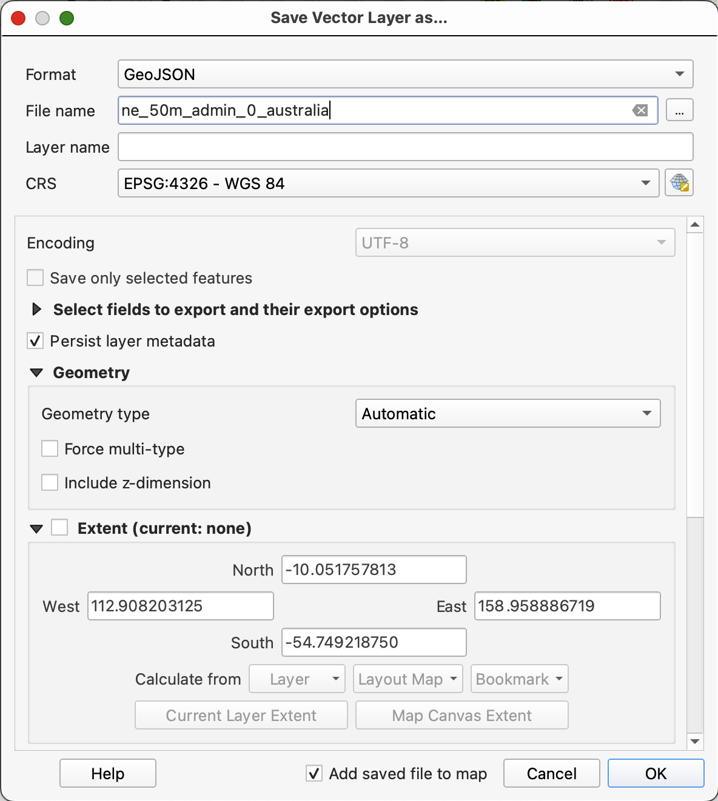

# Final-Project-MAP674
This is the repository for my final project for MAP674. This project will see me incorporate the features I've learned from the assignments in MAP 674 to try to build a map and analyze it. This shows a step-by-step on how my project will be completed.

## Introduction
This section will introduce the final project. It introduces the topic I plan to use for the project and the initial steps to do the project.

### Topic
The topic of my final project will be related to Australia. This final project will involve several maps and datas featuring Australia.

I have included this tuple example in the project to represent that I will focus on Australia.
```
coords = (-25, 133)
print(coords)

coords[0]
```

### Initial steps
The first thing I will do is create a Jupyter notebook file (`ipynb`), which creates the Python. The file will be named `Final-Project` as a `ipynb` file. I also will install Leafmap on conda, terminal, and on Python as I plan to explore the feature and apply it in the project.

On Python, I will install it by adding `pip install leafmap`. When I import it, I will likely use one of the following on <a href="https://leafmap.org/get-started/">this link</a> or add `import leafmap` into my `ipynb` file. I also created a sample `ipynb` file called `install-leafmap`.

This project involves the use of geojson and csv files. Therefore, I will create a folder called `data` to put those files in the folder.

I will create a folder called `assignment`, which is where the `Final-Project` Jupyter Notebook Python file will be located.

## Jupyter File Steps
These are the steps on how I create the Jupyter notebook file.

First, I will import the following Python features into my Jupyter notebook file:

```
%matplotlib inline

import pandas as pd
import geopandas as gpd
import matplotlib.pyplot as plt

import leafmap
```

I will then create several geopandas read files (`gpd.read_file`) consisting of CloudFront files that I plan to use. Stuff I plan to do include clipping points and creating spatial overlays.

## Clipping points
I will be clipping points by using the `gpd.read_file` read files that consist of clipping points.

### Filtering the Australia map

The `ne_50m_admin_0_countries` file, which was original downloaded from <a href="https://www.naturalearthdata.com/downloads/50m-cultural-vectors/50m-admin-0-countries-2/">Natural Earth Data</a>. Once downloaded, I will open up the ZIP folder, which is `ne_50m_admin_0_countries.zip` and it will show the files contained in it. For the file itself, I plan to focus on Australia. To do that, I will right click "ne_50m_admin_0_countries" and select the "Filter" section. It will open this file (see above), and to fix this, I will click on "NAME" in the Fields section, and select Australia from the "Sample" section. It will produce `"NAME" = 'Australia'` once both steps are done, and once I click ok, it produces Australia.

I also will use the `ne_50m_populated_places` from <a href="https://www.naturalearthdata.com/downloads/50m-cultural-vectors/50m-populated-places/">this link</a> and use the same process for the `ne_50m_admin_0_countries`. I will create a fields and sample that produces `""SOV0NAME" = 'Australia'`. 

### Exporting the file

To export the file, right click it and select `Save Features As` in the export tab. The name of the file will be `ne_50m_admin_0_australia` and it will be as a geojson file. It looks something like this above, and when finished, select ok.

I will do the same thing for my populated places file and export it the same process I did with the other file. The file will be called `ne_50m_populated_places_australia.geojson`.

### Importing the data
I will import the following data into the file:
```
countries = gpd.read_file('../data/ne_50m_admin_0_australia.geojson')
pop_places = gpd.read_file('../data/ne_50m_populated_places_australia.geojson')
```

Then I will add this to change the default figsize:
```
# change default figsize
plt.rcParams['figure.figsize'] = (14, 8)
```

### Plotting the country
This will show how I plot the country. In this case, Australia will be used.

Once imported, I will include this below, which will produce a map of the world.

```
fig, ax = plt.subplots()

base_color = '#000000'
border_color = base_color
marker_color = '#000000'

countries.plot(ax=ax, edgecolor=border_color, color='#FF0000', zorder=1);
pop_places.plot(ax=ax, color=marker_color, markersize=3, zorder=2);
```

I will use `australia_poly = australia.geometry.unary_union` to determine what type of polygon is it. When I run it, it says that it is a MultiPolygon. Afterwards, I will use `australia_places = pop_places[pop_places.geometry.intersects(australia_poly)]` to create new GeoDataFrame of points that intersect with the clipping polygon.

Once those are added, I will add the following feature below to help set up the next step, which is to plot the clipped points for Australia.
```
fig, ax = plt.subplots()

base_color = '#f0f0f0'
marker_color = '#448ee4'

australia.plot(ax=ax, color=base_color, zorder=0);
australia_places.plot(ax=ax, color=marker_color, markersize=30, zorder=1);
```

### Plotting the clipped points for Australia
In this section, I demonstrate how I plot the clipped points features for Australia.

What I did is apply this:
```
fig, ax = plt.subplots()

base_color = '#f0f0f0'
marker_color = '#448ee4'

australia.plot(ax=ax, color=base_color, zorder=0);
australia_places.plot(ax=ax, color=marker_color, markersize=30, zorder=1);

australia_places.apply(lambda x: ax.annotate(text=x['NAME'],
                                  xy=x.geometry.coords[0],
                                  xytext=(6, 6),
                                  textcoords="offset points"),
                              axis=1);
```

## Leafmap
Another feature I plan to use is Leafmap. First, I will create a Jupyter notebook file called `Australia-Leafmaps.ipynb`. I will use Australia and learn the Leafmap features. I will apply the steps that were used in <a href="https://leafmap.org/">this link</a> to create examples of Leafmaps of Australia. To create a Leafmap using Australia, I will use -25 and 133 for the center.

I can create a simple Leafmap map for Australia. I did this by adding the following link:
```
import leafmap
m = leafmap.Map(center=(-25, 133), zoom=4)
m
```

I also created a Leafmap topo map for Australia. I used the same steps I did for the simple example, but this time, I have added `m.add_basemap("OpenTopoMap")` to it. It produces this:
```
m = leafmap.Map(center=(-25, 133), zoom=4)
m.add_basemap("OpenTopoMap")
m
```

## Accessing the notebook
I will have more details on how I completed this project in my notebook. To access it, click the assignment folder and it will show it.